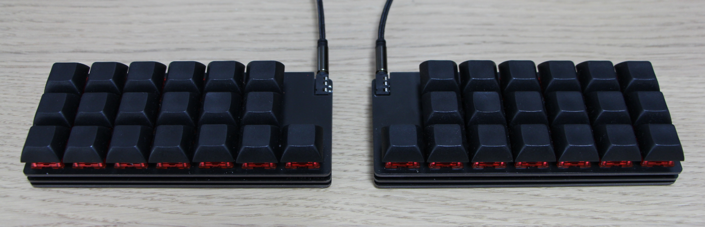

# pisces
Pisces - Tiny Split Keyboard

# Concept

* Ortholinear
  * 3 rows \* 6 columns + 1 thumb key, total 38 keys
* Key switch hot-swap capable
  * Supports Kailh PCB socket for MX
* Thin design
  * Only supports SMT diodes (1N4148W)

# BOM list

Number of components in the following bill of material table is for one hand.

**Here are the mandatory items:**
| Name         | Parts id       | Number | Note                                                                                    |
| ------------ | -------------- | ------ | --------------------------------------------------------------------------------------- |
| Diode        | 1N4148W        | 19     | Availaable from [here](https://akizukidenshi.com/catalog/g/gI-07084/)                   |
| ATmega32U2     | -              | 1      | |
| TRRS jack    | PRT-12639      | 1      | Available from [here](https://www.sengoku.co.jp/mod/sgk_cart/detail.php?code=EEHD-4VML) |
| TRRS cable   | -              | 1      |                                                                                         |
| Reset Switch | TVAF06-A020B-R | 1      | Available from [here](https://akizukidenshi.com/catalog/g/gP-14888/)                    |

**For Cherry MX profile:**

| Name             | Parts id     | Number | Note                                                                                                    |
| ---------------- | ------------ | ------ | ------------------------------------------------------------------------------------------------------- |
| Socket (MX)      | CPG151101S11 | 19     | [here](https://kbdfans.com/collections/switches/products/mechanical-keyboard-switches-kailh-pcb-socket) |
| Spacer (M2 7mm)  | ARB-2007E    | 6      | [here](https://www.hirosugi-net.co.jp/shop/g/g2392/)                                                    |
| Thread (M2 3mm)  | -            | 12     | [here for example..](https://www.amazon.co.jp/dp/B083DR1YQL/ref=cm_sw_em_r_mt_dp_sWb6FbA93WCSS)         |

